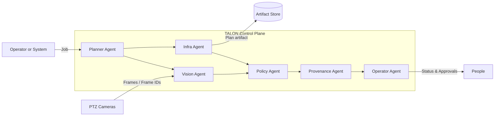
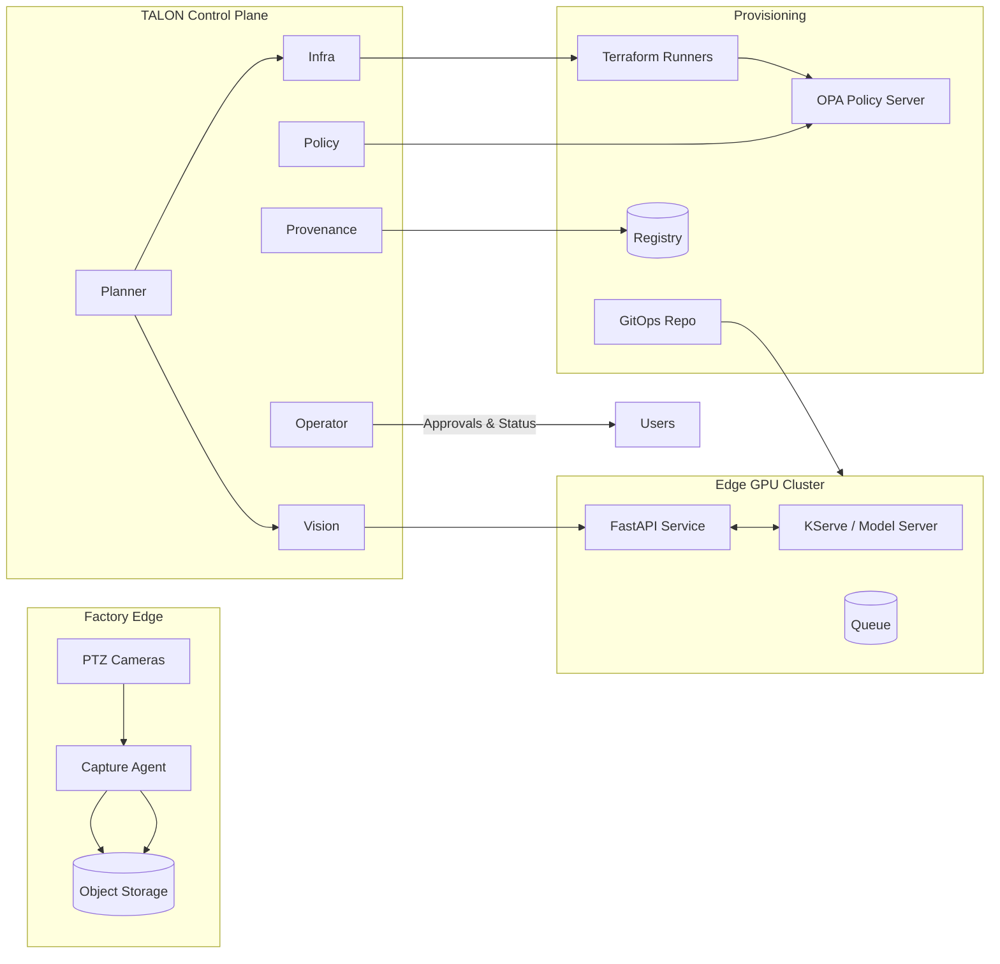

# TALON • Tactical Agentic Layer for Orchestrated eNvironments

**Vendor:** Reliable AI Network, Inc. (RAIN)  
**Client:** Blue Eagle Robotics (BER)

> **One agentic control plane** for factory operations. TALON unifies camera gauge checks and policy-gated infrastructure changes under a single orchestrator with end-to-end provenance.

---

## Why TALON

Factories need two reliable capabilities in **one** platform:
1. **Perception reliability** — trusted, fast readings from cameras with a verifiable audit trail.  
2. **Provisioning trust** — infrastructure changes proposed, reviewed, policy-checked, approved, applied, and recorded.

TALON provides a single multi-agent control plane so operations, security, and engineering share one source of truth.

---

## Core concepts

- **Planner agent**: Interprets requests and composes steps for specialists.  
- **Vision agent**: Produces a reading from a frame with value, confidence, and latency.  
- **Infra agent**: Generates IaC plans (e.g., Terraform) and coordinates apply.  
- **Policy agent**: Enforces thresholds (perception) and policy-as-code (provisioning).  
- **Provenance agent**: Writes immutable records for every job.  
- **Operator agent**: Posts status/approvals to issue trackers/chat (pluggable).

---

## Flow diagram



---

## Reference architecture



---

## Features

- Unified API for **perception jobs** and **provisioning jobs**  
- **Threshold policies** for readings; **OPA guardrails** for plans  
- Immutable **provenance** for 100% of jobs  
- GitOps-friendly, air-gap-ready delivery patterns  
- Lightweight start, production-grade extensibility

---

## Quick start

```bash
# 1) Run TALON locally
python -m venv .venv && source .venv/bin/activate   # Windows: .\.venv\Scripts\activate
pip install -r talon/requirements.txt
uvicorn talon.app:app --reload --port 8080

# 2) Send a perception job
curl -s -X POST localhost:8080/job/perception \
  -H "Content-Type: application/json" \
  -d '{"image_id":"frame-001","roi":[0,0,100,100]}'

# 3) Send a provisioning job
curl -s -X POST localhost:8080/job/infra \
  -H "Content-Type: application/json" \
  -d '{"change_request":{"add":["rg","vnet"]}}'

# 4) Check provenance
ls /mnt/data/talon-prov
```

---

## API

**POST `/job/perception`**  
Request:
```json
{ "image_id": "frame-001", "roi": [0,0,100,100] }
```
Response:
```json
{
  "image_id":"frame-001",
  "value":"73.1 psi",
  "confidence":0.956,
  "latency_ms":620,
  "model_version":"gaugelens-1.2.3",
  "policy":{"status":"pass","checks":{"min_confidence":0.92,"max_latency_ms":2000}},
  "job_id":"<uuid>",
  "time": 1733340000.0
}
```

**POST `/job/infra`**  
Request:
```json
{ "change_request": { "add": ["rg","vnet"] } }
```
Response:
```json
{
  "plan_id":"plan-2048",
  "summary":{"add":["rg","vnet"],"change":[],"destroy":[]},
  "artifact_ref":"artifacts/plan-2048.bin",
  "policy":{"status":"pass","violations":[]},
  "job_id":"<uuid>",
  "time": 1733340000.0
}
```

---

## Use cases

- **Gauge verification at changeover**  
  Operators need fast, trustworthy readings when a line switches products. TALON routes frames to Vision, enforces confidence/latency thresholds, and records provenance for audits.

- **Safe infrastructure changes before a run**  
  Engineers add or adjust network slices. TALON generates a plan, runs policy checks, requires approval, and archives artifacts so every change is traceable.

- **Compliance evidence on demand**  
  Auditors need to see who changed what and how readings were produced. TALON stores signed records for both flows with inputs, versions, outputs, and links to work items.

---

## User stories

1. **As a line operator**, I submit a camera job and receive a pass/review signal within 2 seconds so production isn’t delayed.  
   - Acceptance: p50 latency ≤ 2s, confidence ≥ 0.92 for pass, provenance saved.

2. **As an infra engineer**, I receive a plan artifact and policy report for my change so I can fix violations before approval.  
   - Acceptance: plan stored, OPA rules run, violations listed with clear messages.

3. **As a compliance officer**, I can trace any reading/change back to inputs, models, approvals, and time.  
   - Acceptance: 100% of jobs have a provenance record with versions and work-item links.

4. **As a platform owner**, I want one orchestrator and policy surface for both flows to reduce tool sprawl.  
   - Acceptance: single control plane handles both job types; unified alerts and status.

---

## Acceptance targets

- **Perception**: accuracy target ≥ 95% on a labeled pilot set; latency p50 ≤ 2s, p95 ≤ 5s  
- **Provisioning**: PR-only, policy-gated, plan artifacts archived; zero critical violations in pilot  
- **Auditability**: 100% job coverage in provenance with links to work items

---

## Security & compliance

- Signed container images, GitOps delivery patterns  
- Policy-as-code for IaC (OPA packs: naming, tags, CIDRs, ports)  
- Versioned threshold policies for perception  
- Immutable provenance with optional detached signatures

---

## Local development

```bash
# Service
uvicorn talon.app:app --reload --port 8080

# IaC starter
cd terraform
cp terraform.tfvars.example terraform.tfvars
terraform init
terraform plan
```

---

## Repository layout

```
docs/            SOW, HLD, LLD, 30-60-90, architecture.mmd
talon/           FastAPI app and agent modules (Planner, Vision, Infra, Policy, Provenance)
terraform/       IaC starter and policy folder
runbooks/        Deploy, triage, rollback guides
```

---

## Roadmap

- Swap Vision mock for packaged model server or KServe  
- Connect Infra agent to runners and artifact storage  
- Integrate OPA evaluation for plans; expand policy packs (tags, names, CIDRs)  
- Add Operator hooks for Jira/chat approvals  
- Enable air-gapped delivery and image signing in CI

---

## License

MIT

---

## Support

##### Reliable AI Network, Inc.  
###### oliver@reliableAInetwork.com  
