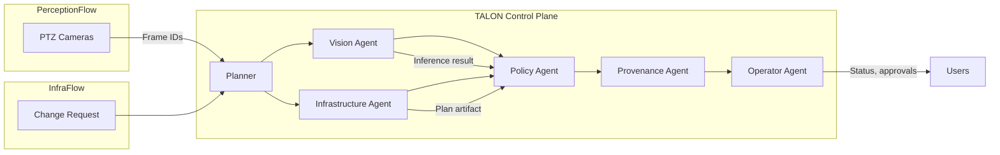

# High‑Level Design (HLD)

**Customer/Vendor:** Blue Eagle Robotics (BER) / Reliable AI Network (RAIN)  
**Product:** TALON — Tactical Agentic Layer for Orchestrated eNvironments  
**Version/Date:** v0.1 • 2025‑10‑01  

---

## 1. Context and Goals

Blue Eagle Robotics operates complex manufacturing lines that rely on both machine vision and automated infrastructure provisioning.  Operators need real‑time, trustworthy gauge readings to ensure product quality, while engineers require reliable, policy‑compliant automation for network and compute changes.  Historically, these domains were managed by separate tools and teams, resulting in duplicated effort, inconsistent logging and increased risk.  

TALON (Tactical Agentic Layer for Orchestrated eNvironments) is RAIN’s unified control plane designed to combine **perception reliability** and **provisioning trust** under one architecture.  TALON coordinates a set of agents to handle vision inference, infrastructure plan generation, policy enforcement and provenance recording.  The platform’s goals are to provide consistent, auditable workflows, reduce tool sprawl, and accelerate value delivery to BER.  This HLD outlines the overall architecture, key components, security considerations and success criteria.

## 2. High‑Level Architecture Overview

A typical high‑level design document contains an introduction, architecture overview, technology choices, data and integration architecture, security measures, deployment approach and risk mitigation strategies【662282491649061†L104-L128】.  TALON follows these principles by structuring its architecture around clear components and interfaces.  

TALON is composed of a **control plane** and several **specialist agents**:

* **Planner** – Orchestrates jobs and routes requests to the appropriate agent (Vision or Infra).  Handles job metadata and context.
* **Vision Agent** – Performs gauge inference by sending region‑of‑interest frames to a model server (e.g., KServe).  Returns values, confidence scores and latency metrics.
* **Infrastructure Agent** – Generates infrastructure plans (e.g., Terraform) based on change requests and manages plan artefacts.
* **Policy Agent** – Applies guardrails and evaluates results against defined thresholds.  For perception jobs, it checks confidence and latency; for infra jobs, it evaluates policy-as-code (OPA) rules.
* **Provenance Agent** – Records signed events (image signatures, SBOMs, plan artefacts) to an immutable store and transparency log.
* **Operator Agent** – Integrates with external systems such as Jira or messaging tools to send status updates and collect approvals.

These agents are delivered as containerised microservices running on a hardened Kubernetes cluster.  TALON exposes two primary REST APIs: `/job/perception` and `/job/infra`.  Each request triggers an orchestrated flow and returns signed results along with policy evaluations and job identifiers.

### 2.1 Logical View

The logical view describes major components and their interactions.  TALON’s control plane routes jobs through a series of agents to produce outputs and provenance.  The diagram below depicts the main flows:

#### Data Flow

* **Perception jobs**: A camera or capture process sends a frame identifier and region of interest (ROI) to the Planner.  The Vision agent retrieves the frame from the image store, performs inference using the deployed model and returns value, confidence and latency.  The Policy agent checks thresholds (e.g., minimum confidence and maximum latency) and the Provenance agent records the result along with a signed SBOM and signature.  The Operator agent posts the outcome to monitoring dashboards or messaging channels. 
* **Infrastructure jobs**: A change request (e.g., adding a resource group and network) is passed to the Infrastructure agent.  It generates a Terraform plan artefact and summarises the changes.  The Policy agent evaluates the plan against guardrails (naming conventions, tag requirements, network rules).  The Provenance agent records the plan, signature and policy result.  The Operator agent sends the plan summary for approval before apply.

### 2.2 Deployment View

TALON is deployed on a secure Kubernetes cluster in BER’s on‑premises environment or private cloud.  Agents are packaged as container images, signed with Cosign and include SBOM attestations.  An example deployment view includes:

* **Edge tier** – PTZ cameras and capture agents run on industrial PCs or smart cameras within each manufacturing line.  They produce frame identifiers and optionally pre‑process images for inference.
* **Cluster tier** – A GPU‑enabled Kubernetes cluster hosts the model serving platform (e.g., KServe), the TALON control plane and the policy engine.  Each agent runs as a deployment with dedicated RBAC and network policies.  The cluster integrates with secrets management (e.g., Key Vault) for credentials and keys.
* **Registry and Transparency services** – A container registry stores signed images, SBOM attestations and Terraform artefacts.  A Rekor transparency log records signatures and is mirrored into the air‑gapped environment for offline verification.
* **Integration endpoints** – Hooks to external systems (Jira, Confluence, Teams/Slack) and optional integration with Azure DevOps or GitHub for plan reviews and approvals.

### 2.3 Technology Architecture

TALON leverages a combination of open‑source and enterprise tools:

* **FastAPI** for the control plane and agent HTTP endpoints.
* **Python** for agent implementations with Pydantic models for input/output validation.
* **KServe** or **Triton** for GPU‑accelerated model serving on the Vision path.
* **Terraform** for infrastructure plans; **OPA/Conftest** for policy evaluation.
* **Cosign** for signing container images and attestations; **Syft** for generating SBOMs.
* **Kubernetes** for orchestration; **Istio** or **NGINX** ingress for secure routing.
* **Key Management Services** (e.g., Azure Key Vault) for storing signing keys and secrets.

## 3. Security Architecture

Security is one of the most important aspects of any architecture; good security provides confidentiality, integrity and availability assurances【648799904540875†L54-L58】.  TALON adopts a defence‑in‑depth approach across identities, networks, data, and application layers.

### 3.1 Identity and Access

* **Zero Trust principles** – All requests to the control plane are authenticated and authorised.  Service‑to‑service communication uses mutual TLS and strict RBAC policies.
* **OIDC and short‑lived certificates** – Agents and pipelines authenticate via OIDC providers, enabling keyless signing and reducing risk of long‑lived credentials.
* **Role‑based access control** – Each agent runs under a least‑privilege identity.  Only authorised roles can trigger infra plans or approve changes.

### 3.2 Data Protection

* **Encryption** – All communications between components use TLS.  Data at rest (frames, SBOMs, plan artefacts) is encrypted using cluster‑native storage encryption.
* **Secrets Management** – Sensitive information such as signing keys, API tokens and database credentials are stored in a dedicated secret store (e.g., Key Vault).  Access is audited and rotated regularly.
* **SBOM and Signature Storage** – SBOMs and signatures are attached as Cosign attestations and stored in the registry.  Recording these in Rekor ensures tamper resistance and verifiable provenance.

### 3.3 Policy Enforcement

* **Policy‑as‑code** – Infrastructure plans are evaluated against OPA policies before apply.  Policies cover naming conventions, tagging, network controls and resource quotas.  Perception policies define acceptable confidence/latency thresholds.
* **Automated checks** – Integration with CI/CD pipelines ensures that unsigned images or failing policies prevent promotion to production.  This aligns with DevSecOps practices and reduces risk of unreviewed changes.

### 3.4 Threat Protection and Monitoring

* **Layered monitoring** – Telemetry from the Kubernetes cluster (CPU/GPU utilisation, network traffic) and from TALON agents (latency, error rates) is collected into a central observability stack (e.g., Prometheus, Grafana, ELK).
* **Anomaly detection** – Alert rules identify anomalies such as elevated inference latency, repeated policy violations or unexpected plan changes.
* **Incident response** – Signed provenance records enable post‑incident analysis.  Integration with a SIEM (e.g., Sentinel or Splunk) provides threat intelligence correlation.

## 4. Integration Architecture

* **Inbound Integrations** – Cameras or capture agents send frame IDs to the Vision path; engineers submit change requests through the REST API or from a front‑end portal.  CI pipelines can call the `/job/infra` endpoint after generating a change plan.
* **Outbound Integrations** – TALON pushes notifications and artefacts to Jira for work item traceability, Confluence for runbook updates, and messaging platforms (Teams/Slack) for real‑time alerts.  Terraform plans can be exported to Git repositories for peer review.
* **Data Integration** – SBOM files can be ingested into vulnerability management tools.  Results from perception jobs can be logged to data warehouses for quality analysis.

## 5. Quality Attributes and Success Metrics

High‑level design documents often include sections on non‑functional requirements and risks【662282491649061†L104-L128】.  TALON defines the following key quality attributes and measurable success criteria to evaluate effectiveness and return on investment:

* **Accuracy and Latency** – For perception jobs, gauge reading accuracy must meet ≥95 % on the pilot dataset and maintain a median latency ≤2 s (95th percentile ≤5 s).  These thresholds ensure operators can make real‑time decisions.
* **Reliability** – System availability targets 99.9 % uptime for the control plane and agents.  Automated failover and redundancy within the Kubernetes cluster support this target.
* **Security Incident Reduction** – Integration of image signing, SBOM attestation and policy gating aims to reduce security incidents.  Cloud architecture success metrics include security incident reduction as a key performance indicator【728567826932342†L108-L118】.
* **Cost Efficiency** – Adopting IaC and automated policies reduces manual effort.  Cloud architecture ROI metrics emphasise infrastructure cost optimisation, development team productivity and time‑to‑market acceleration【728567826932342†L108-L118】.
* **Team Productivity** – By unifying perception and infra workflows, TALON should decrease context switching and improve throughput of change requests.  Observations such as 65 % faster release cycles when using integrated platforms support this expectation【728567826932342†L255-L260】.
* **Compliance and Auditability** – 100 % of jobs must have complete provenance records.  Auditors should be able to verify artefacts against the transparency log with minimal effort.

## 6. Risks and Mitigation

* **Model Drift** – Over time, the gauge inference model may degrade in accuracy.  Mitigation: schedule regular model retraining and incorporate drift detection thresholds.
* **Integration Complexity** – Initial integration with existing systems (Jira, Confluence, SIEM) may require custom connectors.  Mitigation: use webhooks and standard APIs, start with a pilot and iterate.
* **Latency Spikes** – If Vision inference relies on remote compute, network congestion could increase latency.  Mitigation: deploy edge inference models closer to the cameras and implement fallback strategies.
* **Policy Misconfiguration** – Incorrectly defined guardrails might block valid changes or allow invalid ones.  Mitigation: version and test policies, include approvals and change management.
* **Key Compromise** – If signing keys are compromised, trust is broken.  Mitigation: prefer keyless signing; rotate and revoke keys; monitor logs for suspicious signing activity.

## 7. Deployment and Evolution Plan

1. **Pilot Implementation** – Deploy TALON on a single manufacturing line.  Test end‑to‑end flows, including SBOM generation, image signing, plan evaluation and provenance verification.
2. **CI/CD Integration** – Update pipelines to call TALON APIs.  Incorporate policy checks and gating before apply.  Automate SBOM generation and signing in the build process.
3. **Scale Out** – Expand the control plane and agents across additional lines.  Tune resource scaling based on job volume.  Integrate with enterprise identity providers for SSO.
4. **Monitoring and Feedback** – Collect metrics on performance, reliability and security incidents.  Compare against success targets and adjust configuration.  Gather feedback from operators and engineers.
5. **Continuous Improvement** – Based on metrics and feedback, refine policies, update models, and add new agents (e.g., vulnerability scanning) to support evolving use cases.

## 8. Conclusion

This High‑Level Design outlines how TALON will enable Blue Eagle Robotics to unify vision and infrastructure automation under a single, secure control plane.  By adhering to recognised architecture documentation sections and emphasising security measures【662282491649061†L104-L128】, TALON provides a robust foundation for achieving business goals.  The defined success metrics align with modern cloud architecture evaluation criteria【728567826932342†L108-L118】 and will help BER assess the platform’s effectiveness over time.  With careful implementation and ongoing governance, TALON can deliver reliable, auditable automation that scales with the organisation’s needs.
