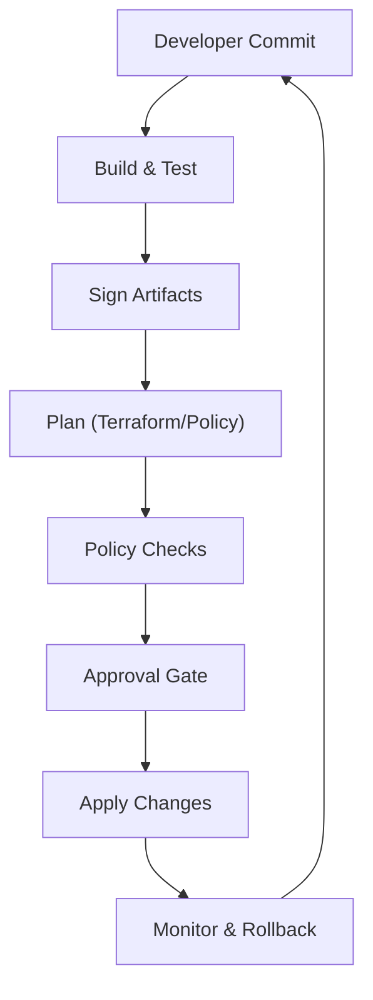

# CI/CD Design

**Customer/Vendor:** Blue Eagle Robotics (BER) / Reliable AI Network (RAIN)  
**Product:** TALON — Tactical Agentic Layer for Orchestrated eNvironments  
**Version/Date:** v0.1 • 2025-10-05  

---

## Purpose

This document defines the continuous integration/continuous delivery (CI/CD) pipeline design for the TALON platform delivered by Reliable AI Network (RAIN) to Blue Eagle Robotics (BER).  The goal of this pipeline is to automate the path from code commit through secure build and signing, infrastructure planning, policy evaluation, manual approval, and safe application of changes.  It draws on industry best practices to ensure that changes are reliable, secure, auditable and compliant.

## Overview

A CI/CD pipeline is an automated workflow that transforms source code and infrastructure definitions into deployed systems.  The pipeline performs steps such as building and testing code, signing release artifacts, planning and validating infrastructure changes, enforcing policy controls, requiring human approval when warranted, and finally applying the changes.  Automating these steps speeds delivery and reduces errors; securing the pipeline and enforcing policy reduces supply‑chain risk.

Best practice for pipelines includes using version control and infrastructure‑as‑code for everything, automating repeatable tasks, shifting security controls left (earlier in the process), and securing the CI/CD environment and deployment strategies.  Policies can be used to control what resources engineers can create, what parameters are allowed, and how many approvals are required for a given run.  Additionally, certain stages may require a manual approval gate for high‑impact changes such as sensitive infrastructure modifications, cost‑heavy operations, production deployments, or regulatory obligations.

## Pipeline Stages

The TALON CI/CD pipeline is composed of the following stages:

### 1. Build & Test

- **Continuous Integration:** When developers push changes to the repository, the pipeline automatically checks out code and integrates it with the existing base.  
- **Automated testing:** Unit, integration and end‑to‑end tests run to verify functionality and prevent regressions.  
- **Build artifacts:** If tests pass, build system packages application code (e.g. Docker images) and infrastructure modules.  All pipeline steps are defined in code and stored under version control to guarantee reproducibility.

### 2. Sign Artifacts

After building, the pipeline signs the compiled artifacts and container images to ensure authenticity and prevent tampering.  Automated code signing integrated into the CI/CD process eliminates delays and logs every signature for audits.  Signing keys are stored securely (e.g. in an HSM or key management system) and access is limited to designated principals.  This ensures that only trusted artifacts progress to later stages and simplifies compliance reporting.

### 3. Plan

Infrastructure‑as‑Code (IaC) changes and policy definitions are planned before they are applied.  For example, when a Terraform module or policy definition changes, the pipeline runs `terraform plan` or the equivalent to generate a **plan artifact**.  This plan describes proposed changes and surfaces deltas to review.  Tools such as Enterprise Policy as Code (EPAC) create a “Policy Plan” that captures changes to policy objects and role assignments.  The plan output is stored in version control or artifact storage and used as input to the next stage.

### 4. Policy Checks

Before a plan can be applied, the pipeline evaluates it against governance policies.  Policy‑as‑code frameworks (e.g. Open Policy Agent or Sentinel) define rules for naming, tagging, security controls, cost thresholds, and compliance.  Policies are grouped into sets and can enforce requirements such as mandatory tagging, approved regions, and size limits.  If any policy violation is detected, the pipeline marks the run for review or fails it.  Using policy as code ensures consistent enforcement across environments and allows engineers to self‑serve while administrators retain control.

Static checks (e.g. branch control, required templates or artifact evaluation) run first, followed by pre‑check approvals, dynamic checks (such as manual approval, invoking functions, business hours, or monitoring alerts), post‑check approvals and exclusive locks.  This ordered sequence ensures that simple rule violations are caught early, while dynamic decisions are handled separately.

### 5. Approval Gate

Once the plan passes policy checks, some runs may require explicit human approval.  Approvals provide situational oversight beyond automated checks.  According to best practices, approval gates should be used for sensitive infrastructure changes, cost‑heavy operations, production deployments, stateful operations, complex multi‑service deployments, regulatory and compliance concerns, maintenance windows, or validation of external dependencies.  The list of approvers and the approval timeout are defined outside of pipeline code (e.g. via the pipeline management UI) so that pipeline authors cannot bypass checks.  Approvers review the plan and policy results, optionally add comments, and approve or reject the run.  Deferred approvals can be scheduled to activate at a predetermined time when change windows open.

### 6. Apply

After approval, the pipeline applies the plan to the target environment.  For infrastructure changes, the pipeline runs `terraform apply` or the appropriate deployment mechanism.  For policy changes, tools like EPAC deploy policy definitions and assignments to the designated scope.  The apply step is executed using service principals or automation accounts with limited privileges to reduce risk.  State is locked during apply to prevent concurrent modifications, and logs are captured for traceability.  Safe deployment strategies such as blue/green or canary can be employed to minimise impact.  If any step fails, the pipeline aborts and triggers a rollback to the previous stable state.

### 7. Monitoring & Rollback

After deployment, the pipeline monitors the health of the system.  Automated tests and probes ensure that the new version is performing as expected.  If metrics degrade or errors occur, the pipeline can automatically rollback or alert operators.  Provenance records, build logs, plan artifacts, policy decisions and approvals are stored in an immutable audit trail so that every change can be traced back to its origin.

## Best Practices

- **Version control and IaC for everything:** Store application code, infrastructure definitions, and pipeline configurations in version control.  Use IaC tools like Terraform or Bicep to model environments.  
- **Automate all repeatable tasks:** Building, testing, signing, planning, policy evaluation and applying should be automated.  Fail pipelines fast on test or policy failures to catch problems early.  
- **Shift security left:** Enforce secure coding practices and run security scans during build.  Use policy as code to evaluate compliance before changes are made.  
- **Secure the CI/CD environment:** Restrict access to build agents and secrets.  Use hardware security modules for code signing keys.  Sign all artifacts and verify signatures at runtime.  
- **Use manual approvals wisely:** Only require approvals when necessary, based on the risk and impact of the change.  Provide clear context to approvers, including plan summary and policy results.  
- **Keep policy definitions code‑based:** Group related policies and document their rationale.  Update policies as requirements evolve and monitor policy coverage regularly.  
- **Ensure auditability:** Maintain a complete provenance of each pipeline run, including commit hashes, build logs, signed artifacts, plan files, policy evaluations, approvals, and apply logs.

## CI/CD Pipeline Diagram

## User Stories

1. **As a developer**, I want to commit changes and have them automatically built, tested, signed, planned, validated and deployed so that I can focus on writing code without worrying about manual release steps.  
2. **As a security officer**, I want all artifacts signed and validated and all policy checks enforced before deployment so that I can ensure compliance and prevent tampering.  
3. **As an infrastructure administrator**, I want a manual approval gate for high‑impact changes (e.g., production, cost‑sensitive or regulatory changes) so that I can evaluate the plan and policy results before allowing the apply stage.

## Acceptance Criteria

- Builds run on every merge and produce signed artifacts ready for deployment.  
- Plans and policy checks run automatically.  Policy violations block progression.  
- Approval gates trigger for predefined scenarios and cannot be bypassed by pipeline authors.  
- Apply stage only runs after successful approvals and uses automation accounts with least privilege.  
- Pipeline logs, plan artifacts, policy evaluations, approvals and deployment results are recorded for auditing.  
- In case of failure at any stage, the pipeline halts and provides diagnostic information to stakeholders.

---

This CI/CD design aligns with modern DevSecOps principles and ensures that the TALON platform for Blue Eagle Robotics is delivered securely, efficiently and compliantly.
