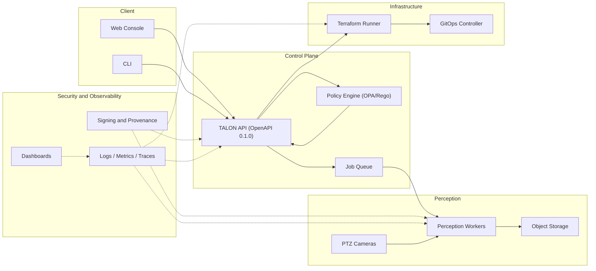

# As‑Built

**Customer/Vendor:** Blue Eagle Robotics (BER) / Reliable AI Network (RAIN)  
**Product:** TALON — Tactical Agentic Layer for Orchestrated eNvironments  
**Version/Date:** v0.1 • 2025-09-10

---

## 1) Purpose
This As‑Built captures the **final deployed architecture**, **versions**, and **configuration** for TALON after pilot cutover. Use it for audits, support, and future upgrades.

## 2) Scope
- Environments: dev, stage, prod (single site).  
- Components: control‑plane, workers, policy, CI/CD, GitOps, observability.  
- Interfaces: perception API, infra API, registry, dashboards.

---

## High‑Level Architecture

---

## 4) Environment Inventory
| Env | Cluster | Purpose |
|---|---|---|
| dev | talon-dev‑01 | Integration & smoke |
| stage | talon-stage‑01 | Pre‑prod & UAT |
| prod | talon‑prod‑01 | Line runtime |

---

## 5) Component Versions
| Area | Component | Version |
|---|---|---|
| Control‑plane | TALON API | 0.1.0 |
| Control‑plane | Policy Pack | 0.1.0 |
| Perception | Worker image | talon-perception:0.1.3 |
| Perception | Model bundle | gauges‑v2.4 |
| Infra | IaC modules | base‑net‑1.2.0; app‑svc‑1.1.1 |
| Infra | GitOps controller |  | 
| CI/CD | Pipeline templates | v2025.10 |
| Security | Cosign policy | v1 |
| Security | SBOM format | SPDX‑2.3 |
| Observability | Dashboards | ops‑suite‑0.4 |
| Registry | Container registry | ghcr.io/rain/talon |

> Replace blanks with your exact values prior to publication.

---

## 6) Images (digests) – prod
| Image | Digest (sha256) |
|---|---|
| ghcr.io/rain/talon‑api:0.1.0 | <digest‑api‑prod> |
| ghcr.io/rain/talon‑perception:0.1.3 | <digest‑perc‑prod> |
| ghcr.io/rain/talon‑infra:0.1.2 | <digest‑infra‑prod> |

---

## 7) Configuration Summary (key manifests)
| Area | Path | Note |
|---|---|---|
| API | envs/prod/apps/api/kustomization.yaml | image, resources |
| Workers | envs/prod/apps/perception/values.yaml | camera map, ROI |
| Infra | envs/prod/apps/infra/kustomization.yaml | runner params |
| Policy | policy/thresholds/ | latency, confidence |
| Policy | policy/infra/ | tags, size limits |
| Observability | dashboards/ | panels, alerts |
| CI/CD | .github/workflows/ | build, sign, attest |

---

## 8) Networking (prod)
| Item | Value |
|---|---|
| API base URL | https://talon.ber.example/api |
| Ingress class | <ingress‑class> |
| CIDR allowlist | <cidr(s)> |
| Camera subnets | <subnets> |

---

## 9) Security Controls (as built)
- Signed images + SBOM verification at deploy.  
- Policy gates on perception thresholds and infra changes.  
- Least‑privilege RBAC with group‑based access.  
- Secrets in KMS/HSM; short‑lived tokens for services.  
- Immutable logs; audit trail for deploys and policy decisions.

---

## 10) CI/CD & GitOps
| Step | Tool | Note |
|---|---|---|
| Build | CI | container build |
| Sign & Attest | cosign | image + SBOM |
| Plan | terraform | dry‑run |
| Policy | OPA | pass/deny |
| Promote | Git PR | env folders |
| Reconcile | GitOps | sync status |

---

## 11) Observability
| Dashboard | Purpose |
|---|---|
| Platform Health | API/queue/worker health |
| Perception Pipeline | latency, confidence, throughput |
| Infra Pipeline | plan→apply success |
| Policy Decisions | pass/deny trends |
| Capacity | CPU/GPU/storage |

**Alerts (examples)**: SLO burn, policy deny spike, unsigned image, unsynced app.

---

## 12) Known Deviations / Waivers
| ID | Area | Deviation | Expiry |
|---|---|---|---|
| KW‑01 | Policy | Min confidence set to 0.78 for line B | 2025‑10‑31 |
| KW‑02 | Infra | Legacy tag exception on net‑mod | 2025‑11‑15 |

---

## 13) Runbooks & Links
- Deploy • Rollback • Triage.  
- Image Signing & SBOM SOP.  
- Policy Pack (Thresholds & OPA).  
- Observability Plan & KPIs.

> Link to the final versions in your repo or knowledge base.

---

## 14) Upgrade Notes
- Freeze window: Tue/Thu 02:00‑04:00 local.  
- Canary for API (10%) before full rollout.  
- Backward‑compatibility note: perception ROI preset names are immutable.

---

## 15) Acceptance & Handover
- Pilot completed; acceptance certificate signed.  
- All manifests and dashboards tagged `asbuilt‑2025‑09‑10`.  
- Operators trained; admin guide delivered.

---

## 16) Revision History
| Version | Date | Change |
|---|---|---|
| 0.1.0 | 2025‑09‑10 | Initial as‑built for pilot |

